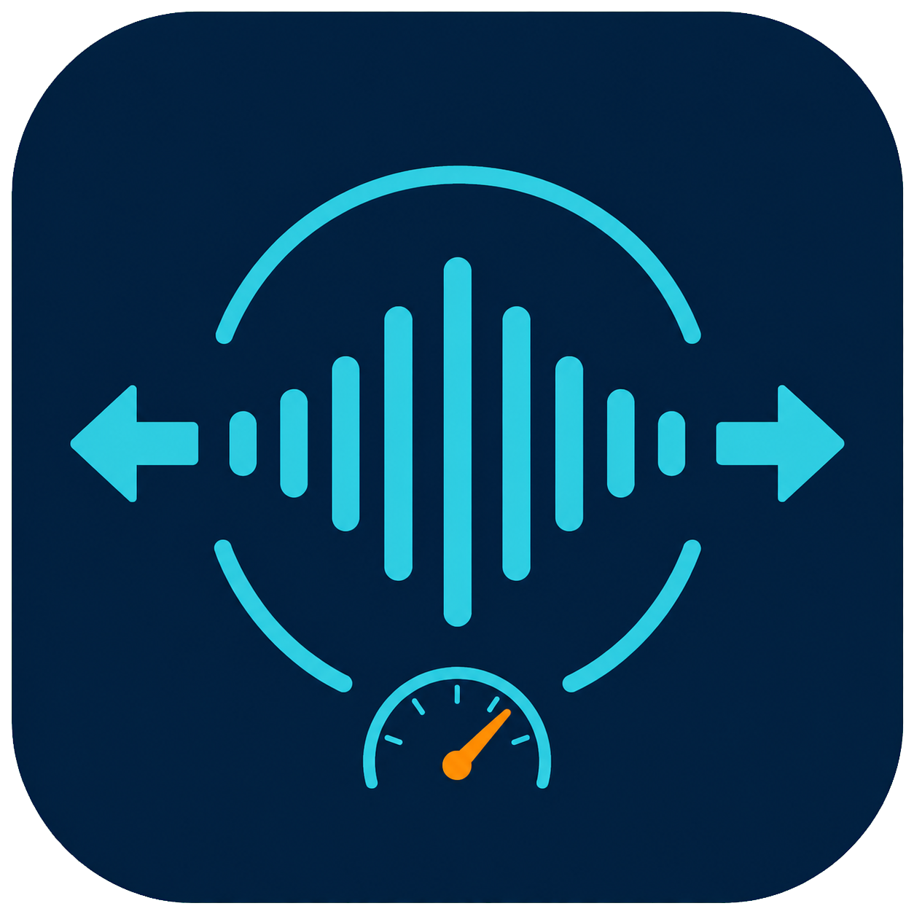

# WAVNormalizer

<p align="center">
  
</p>

免 VST 的伴奏批次優化工具。它會分析疑似去人聲造成的高頻劣化、把真正的單聲道或雙聲道同訊號自然拓寬、套用 Opto 風格壓縮，最後以 ffmpeg 雙階段 EBU R128 loudnorm 輸出一致的直播音量。

## 處理流程

1. 使用 NumPy/SciPy 分析音檔中段最多 45 秒，計算頻譜平坦度、通量、高頻能量與穩定性、相位一致性及 roll-off，輸出保守的品質風險分數。
2. 單聲道音訊使用兩組全通濾波器做相位去相關，再以 `L = Mid + Side`、`R = Mid - Side` 重建。Side 在 150 Hz 高通，因此低頻維持置中；折疊回單聲道時 Side 會抵消。
3. 使用 pedalboard Compressor 套用 3.5:1、10 ms attack、650 ms release 的平滑 Opto 風格設定。
4. 使用 ffmpeg 雙階段 loudnorm 輸出 -14 LUFS、-1 dBTP 的 24-bit WAV。

品質偵測只能作為啟發式守門員，不能取代人工試聽。預設採保守門檻並警告後繼續；需要自動中斷疑似劣質檔案時可選擇 `skip`。

## 直接使用 EXE

下載或複製 `dist\WAVNormalizer.exe` 到存放音檔的資料夾後執行即可。這是單一可執行檔，已內含 Python 相依套件與 ffmpeg，不需要另裝 Python、VST 或 ffmpeg。

也可以在 PowerShell 指定一個或多個音檔或資料夾：

```powershell
.\WAVNormalizer.exe "D:\Music\song.mp3" "D:\Music\set2"
```

## Python 安裝

需求：Python 3.8+、[uv](https://docs.astral.sh/uv/) 與 ffmpeg。

```powershell
uv venv .venv
$env:UV_CACHE_DIR = (Join-Path (Get-Location) '.uv-cache')
uv pip install --python .\.venv\Scripts\python.exe -r .\requirements.txt
```

ffmpeg 可以放在系統 PATH、專案根目錄、`ffmpeg\bin\ffmpeg.exe`，也可於執行時以 `--ffmpeg` 指定。此限制不適用於已打包的 EXE。

## Python 使用方式

沒有參數時，會批次處理腳本所在資料夾內的支援音檔：

```powershell
.\.venv\Scripts\python.exe .\WAVnormalize.py
```

發現疑似水下聲時略過該檔：

```powershell
.\.venv\Scripts\python.exe .\WAVnormalize.py --quality-action skip --quality-threshold 65
```

常用選項：

- `--width 0.35`：拓寬強度，範圍 0–1。
- `--mono-bass-hz 150`：Side 的高通截止頻率。
- `--target-lufs -14`：目標整體響度。
- `--true-peak -1`：True Peak 上限 dBTP。
- `--ffmpeg PATH`：指定 ffmpeg 執行檔。

輸出檔名為 `<原檔名>_enhanced.wav`。工具會略過自己的 `_enhanced.wav` 輸出，並以暫存檔完成後再原子替換既有輸出。

## 建置單一 EXE

```powershell
$env:UV_CACHE_DIR = (Join-Path (Get-Location) '.uv-cache')
uv pip install --python .\.venv\Scripts\python.exe -r .\requirements-build.txt
.\.venv\Scripts\python.exe .\build_exe.py
```

建置結果位於 `dist\WAVNormalizer.exe`。程式會保留主控台視窗，以顯示品質警告與處理進度。

## 測試

```powershell
$env:UV_CACHE_DIR = (Join-Path (Get-Location) '.uv-cache')
uv pip install --python .\.venv\Scripts\python.exe -r .\requirements-dev.txt
.\.venv\Scripts\python.exe -m pytest -q
```

## 版本

### 1.1.0 — 2026-08-13

- 新增保守型音質風險分析與 `warn`/`skip` 策略。
- 新增免 VST 的全通濾波相位去相關拓寬與單聲道低頻。
- 新增 pedalboard Opto 風格壓縮。
- 改為 ffmpeg 雙階段 -14 LUFS / -1 dBTP 正規化與 24-bit WAV 輸出。
- 新增透明應用程式圖示與內嵌 ffmpeg 的單一 EXE。

### 1.0.0 — 2025-09-23

- 支援 WAV、MP3 與 ffmpeg 可解碼格式。
- 提供基礎 loudnorm 音量正規化。
